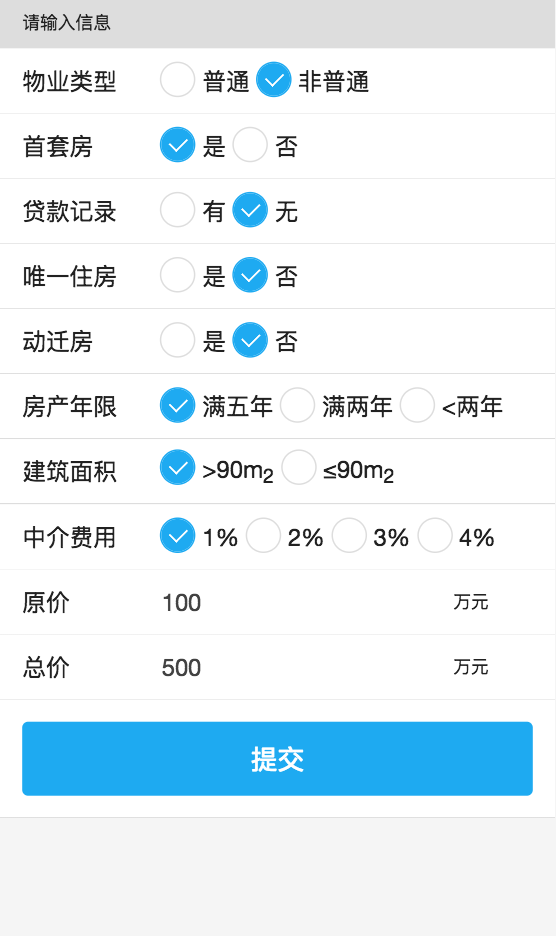

### 上海房产交易计算工具

>买房是件大事，房东的挂牌价包含各种水份，其中交易税是一大坑，同样价格可能购房成本不一样。买房不容易全家All In，所以写了一个网页版的交易税计算器，希望不要掉进资本的坑里，顺便研究了一下前端UI框架和报表框架（发现现在前端开发真的很幸福）。

#### 前端框架
引用了AUI前端框架

[http://www.auicss.com/](http://www.auicss.com/)

#### 图形报表框架
使用了百度的ECharts

[https://www.echartsjs.com/](https://www.echartsjs.com/)

#### 界面截图

